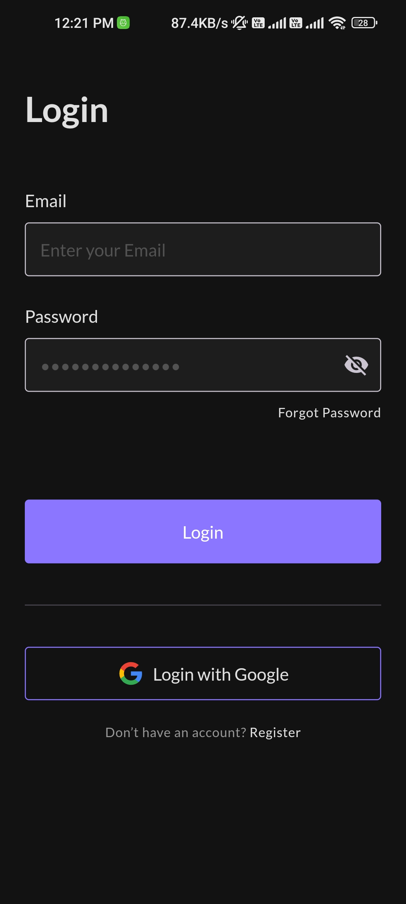

  
  <h1>Tamam</h1>
  
Tamam - Your Ultimate Task Management Solution

  

## Table of Contents

- [Introduction 🏛️](#introduction-🏛️)
- [Demo 🚀](#demo-🚀)
- [Features 🌟](#features-🌟)
- [Screenshots 📸](#screenshots-📸)
- [Packages Used 📚](#packages-used-📚)
- [Authors](#team-section)

  

## Introduction 🏛️

Welcome to Tamam, your go-to Flutter Android application for effective task management. Tamam is designed to streamline your daily activities, boost productivity, and empower you to achieve your goals efficiently. Whether you're a professional looking to organize work tasks or an individual seeking a tool to manage personal responsibilities, Tamam has got you covered.

  

## Demo 🚀

https://github.com/Mina329/Tamam-Todo/assets/96777964/1b47f856-18ba-4510-9d64-c1f300bab433

  

## Features 🌟

- 11+ Screens
- Responsive UI
- Bloc and Cubit State Management
- Clean Architecture
- Localization (7 languages)
- Error Handling
- Cache
- Light & Dark Theme
- Local Notification
- Firebase Auth
- Firebase Firestore
- Firebase Storage
- Local and Remote Datasources
- Hive Database

  

## Screenshots 📸

<table>
  <tbody>
    <tr>
      <td align="center"></td>
      <td align="center"></td>
      <td align="center"></td>
    </tr>
    <tr>
      <td align="center"></td>
      <td align="center"></td>
      <td align="center"></td>
    </tr>
    <tr>
      <td align="center"></td>
      <td align="center"></td>
      <td align="center"></td>
    </tr>
    <tr>
      <td align="center"></td>
      <td align="center"></td>
      <td align="center"></td>
    </tr>
    <tr>
      <td align="center"></td>
      <td align="center"></td>
      <td align="center"></td>
    </tr>
    <tr>
      <td align="center"></td>
      <td align="center"></td>
      <td align="center"></td>
    </tr>
    <tr>
      <td align="center"></td>
      <td align="center"></td>
    </tr>
  </tbody>
</table>

  

## Packages Used 📚

The app utilizes several packages to enhance its functionality. Some of the key packages used include:

- animated_bottom_navigation_bar
- app_usage
- awesome_notifications
- cached_network_image
- cloud_firestore
- cupertino_icons
- dartz
- easy_localization
- firebase_auth
- firebase_core
- firebase_storage
- flutter_bloc
- flutter_colorpicker
- flutter_dnd
- flutter_iconpicker
- flutter_screenutil
- flutter_svg
- fluttertoast
- font_awesome_flutter
- get_it
- go_router
- google_fonts
- hive
- hive_flutter
- image_picker
- intl
- lottie
- month_picker_dialog
- roundcheckbox
- shared_preferences
- smooth_page_indicator
- table_calendar
- url_launcher
- uuid
- vibration

These packages are crucial for enabling various functionalities and enhancing the app's capabilities.

  <h1 align="center">Meet the Visionary Mind Behind the Project 🌟</h1>

  <table align = "center">
    <tr>
      <td align="center"><a href="https://github.com/mina329"></td>
    </tr>
  </table>

  <h2>About Me:</h2>
  <ul>
    <li><strong>Name:</strong> Mina Emil</li>
    <li><strong>Role:</strong> Flutter Developer</li>
    <li><strong>Passion:</strong> Crafting applications that seamlessly blend functionality and aesthetics.</li>
  </ul>

  <h2>Connect with Me:</h2>
  
Feel free to reach out if you have any questions, suggestions, or just want to say hello! You can contact me at
    <a href="mailto:mina.emil.fakhry@outlook.com">mina.emil.fakhry@outlook.com</a>.

  <h2>LinkedIn:</h2>
  

  
Thank you for choosing Tamam. Let's make task management a delightful and efficient experience together!

  

